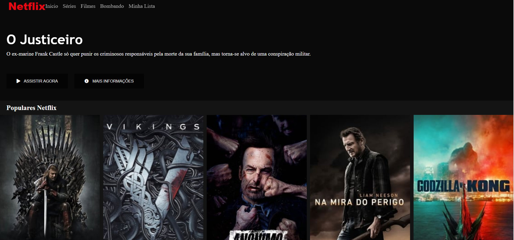

<h3> 💻 Interface Netflix 🎭</h3>

*[$] Desafio da DIO*

 👾 Recriação da interface da Netflix utilizando tecnologias simples como HTML5, CSS3 e JavaScript. 
Esse projeto Teve Intuito de desenvolver: 
<ul>
    <li> Como estruturar um layout,</li>
    <li> Técnicas de CSS3 com containers e variáveis, </li>
    <li>Como posicionar os elementos com Flexbox</li> 
    <li>e como utilizar plugins Jquery a favor da sua aplicação. </li>
</ul>

<h3>📟 Demonstração: <h3>
<h2 aling="center" borde = "1px solid">
    
</h2>

💎 Pretendo Inovar os Layouts e Script no decorrer do aprendizado

*[%] Só sei que Nada Sei - Socrates*
